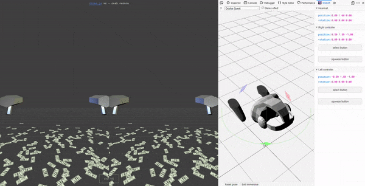
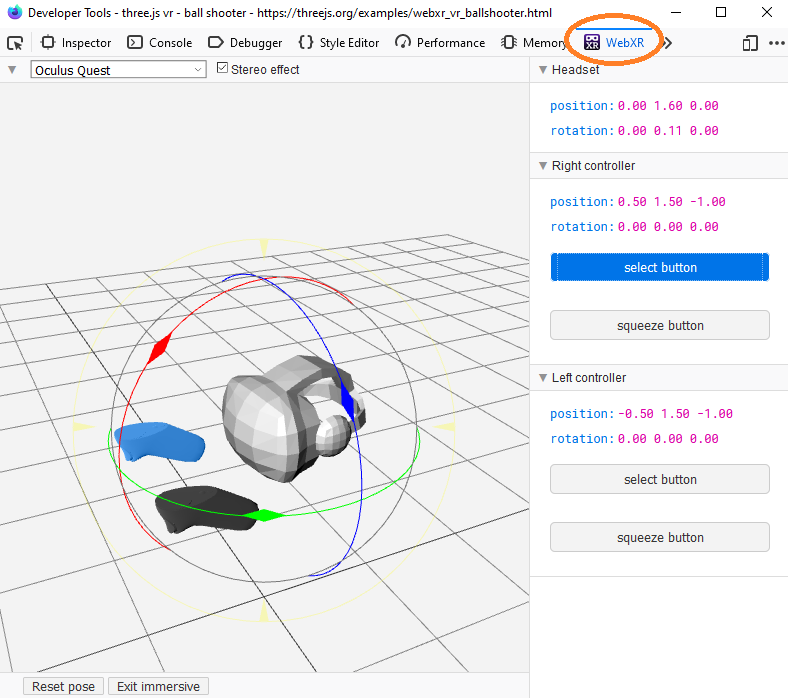
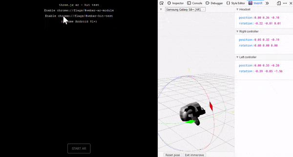

# 👉 This is was a prototype and has been archvied, please see [Handsfree Browser](https://github.com/midiblocks/handsfree-browser)

> 🚨 This project is still an experiment 🚨
>
> Please see [the original Mozilla WebXR Emulator Extension](https://github.com/MozillaReality/WebXR-emulator-extension) or see the instructions in the section titled "[ORIGINAL DOCUMENTATION](#original-documentation)" below for instructions on how to use the extension. 

This is an implementation of [Handsfree.js](https://handsfree.js.org) to emulate WebXR devices handsfree!

## How Handsfree Mode works


0) Visit any WebXR page. For testing, I like [Pointer Painter](https://immersive-web.github.io/webxr-samples/tests/pointer-painter.html)
1) After installing the extension (see below), open up the WebXR tab in devtools
2) Click Start Handsfree at the bottom and wait a few seconds, you'll start to see the headset move when it's ready
3) Enter VR

### Notes
- Everything happens in your browser
- Press <kbd>Stop Handsfree</kbd> or reload the page to stop the webcam
- If you reload page the camera will be stopped, but because the DevTools is in a different context it may still show <kbd>Stop Handsfree</kbd>. You can click it again to refresh it (this will be fixed)
- Head tracking currently works best when you're centered with the camera, this will definitely be fixed to allow for more range of motion

---

# Dev notes

- If you make changes, you'll need to update the extension again. You'll also need to close devtools and open it again...it's not enough to just refresh the page :(

## Adding Handtracking

I haven't explored it yet, but the following files are where everything for head tracking is happening:

### Inject your computer vision model here: `/src/handsfree/background.js`
This script gets injected into the web page and is where you should load your models. You can use [Handsfree.js](https://handsfree.js.org/ref/model/hands) (which currently only supports the 2D hands) or you might want to use [TensorFlow 3D Handpose](https://github.com/tensorflow/tfjs-models/tree/master/handpose).

### Run your computer vision model here: `/src/handsfree/content.js`

To send data to the DevTools (the `/src/handsfree/pane.js` script) from the webpage that has the model, you'll need to post a message:

```js
port.postMessage({
  action: 'handsfree-data',
  data: {weboji}
})
```

Basically add or replace the code in their with Handpose data.

### Update the actual 3D controller models here: `/src/handsfree/panel.js`

Listeners are already set on the models thanks to the Mozilla Extension, so all you need to do is simply set the position/rotation. See how I'm doing it for headtracking:

```js
// Update assetNodes
// The other ones to check are: DEVICE.CONTROLLER, DEVICE.RIGHT_CONTROLLER, DEVICE.LEFT_CONTROLLER
assetNodes[DEVICE.HEADSET].rotation.x = message.data.weboji.rotation[0]
assetNodes[DEVICE.HEADSET].rotation.y = message.data.weboji.rotation[1]
assetNodes[DEVICE.HEADSET].rotation.z = message.data.weboji.rotation[2]

// Update everything. The Polyfill will handle the rest
updateHeadsetPropertyComponent()
notifyPoseChange(assetNodes[DEVICE.HEADSET])
render()
```

These are just quick draft notes. I'll have a full tutorial soon!

<br>
<br>
<br>
<br>
<br>
<br>
<hr>
<br>
<br>
<br>
<br>
<br>
<br>

# ORIGINAL DOCUMENTATION

WebXR emulator extension is a browser extension which helps your WebXR content creation. It enables you to responsively run [WebXR](https://www.w3.org/TR/webxr/) applications on your **desktop** browser without the need of any XR devices. 

[Blog post](https://blog.mozvr.com/webxr-emulator-extension/) / [YouTube](https://www.youtube.com/watch?v=Twnzp-LEMkU) / [Slides (in Japanese)](https://docs.google.com/presentation/d/1J-QDpm27eGzHi0vsPEqZSd5aun-GSWUm-FQC19qjSRA/edit#slide=id.g4775d037d5_0_0)



## Features

- [WebXR API polyfill](https://github.com/immersive-web/webxr-polyfill)
- Multiple XR devices emulation
- Both VR and AR support
- Graphical device emulator control with [Three.js](https://threejs.org/)
- Cross browsers support with [WebExtensions API](https://developer.mozilla.org/en-US/docs/Mozilla/Add-ons/WebExtensions)
<!-- - [Virtual controller (WIP)](./screenshots/virtual-controller.gif) -->

## Status

- Based on [WebXR device API draft issued on 10 October 2019](https://www.w3.org/TR/webxr/)
- No device specific emulation yet
- Supports only trigger and squeeze buttons, not other buttons

## Browsers

This extension is built on top of [WebExtensions API](https://developer.mozilla.org/en-US/docs/Mozilla/Add-ons/WebExtensions). It works on Firefox, Chrome, and other browsers supporting the API.

## How to use

1. Go to the addon stores to install ([Firefox](https://addons.mozilla.org/firefox/addon/webxr-api-emulator), [Chrome](https://chrome.google.com/webstore/detail/webxr-api-emulator/mjddjgeghkdijejnciaefnkjmkafnnje))

2. Go to WebXR application page (for example [WebXR examples](#WebXR-examples)). You will notice that the application detects that you have a XR device (emulated) and it will let you enter the immersive (VR、AR) mode.

3. Open "WebXR" tab in the browser developer tool ([Firefox](https://developer.mozilla.org/en-US/docs/Tools), [Chrome](https://developers.google.com/web/tools/chrome-devtools/)) to controll the emulated devices. You can move the headset and controllers, and trigger the controller buttons. You will see their transforms reflected in the WebXR application.



## How to control the emulated devices

By clicking a device in the devtool panel, you can select gizmo mode of the device. By dragging a gizmo, you can rotate or translate the device.

## Configuration

You can configure some settings from the top in the WebXR tab.

### Device

You can switch emulated device. The difference between devices is just degrees of freedom and the number of controllers for now.

| Device | Description |
| ---- | ---- |
| None | No device |
| Google Cardboard | 3dof headset and no controller |
| HTC Vive | 6dof headset and two 6dof controllers |
| Oculus Go | 3dof headset and 3dof controller |
| Oculus Quest | 6dof headset and two 6dof controllers |
| Samsung Gear VR | 3dof headset and 3dof controller |

### Stereo Effect

You can enable/disable Stereo Effect which renders two views.

## AR mode

WebXR emulator extension also supports AR. You can test WebXR AR application on an emulated device in a virtual room, on your desktop browser.



### How to use

1. [Download and manually install the newest extension from dev branch](#how-to-install-the-newest-version)

2. Select "Samsung Galaxy S8+ (AR)" device from the device list on the top of WebXR devtool panel

3. Go to WebXR application page, for example [Three.js WebXR AR examples](https://threejs.org/examples/?q=webxr#webxr_ar_paint)

4. You will notice that the application detects that you have a XR device (emulated) and it will let you enter the immersive (AR) mode

5. AR application starts on the emulated device in a virtual room

### How to control

You can control the camera (view) and tablet in the application window.

| user action | camera/tablet control |
|----|----|
| Left mouse button drag | Camera rotation |
| Right mouse button drag | Camera pan |
| Middle mouse button drag or wheel | Move camera forward/backward |
| Mouse click on the tablet | Change the tablet gizmo mode |
| Gizmo on the tablet | Tablet rotation/translation |
| Right mouse button click on the tablet screen | touch input |

### How to control in the devtool panel

You can still control the camera and tablet in the devtool panel similar to VR.

| Devtool panel | AR virtual room |
|----|----|
| Camera | View |
| Right controller | Finger (not shown in the application window) |
| Left controller | Tablet |

## For development

### How to install the newest version

If you want to develop or debug this extension or if you want to use the under development (not released yet) version, download this repositoy and install the extension into your browser as developer mode. ([Firefox](https://developer.mozilla.org/en-US/docs/Mozilla/Add-ons/WebExtensions/Temporary_Installation_in_Firefox), [Chrome](https://developer.chrome.com/extensions/getstarted))

### How to build polyfill/webxr-polyfill.js

`polyfill/webxr-polyfill.js` is created with npm.

```sh
$ git clone https://github.com/MozillaReality/WebXR-emulator-extension.git
$ cd WebXR-emulator-extension
$ npm install
$ npm run build
```

## Note

- Even if native WebXR API is available the extension overrides it with WebXR polyfill

## WebXR examples

- [WebXR Samples](https://immersive-web.github.io/webxr-samples/)
- [Three.js WebXR VR examples](https://threejs.org/examples/?q=WebXR#webxr_vr_ballshooter)
- [Babylon.js WebXR examples](https://doc.babylonjs.com/how_to/webxr_demos_and_examples)
- [A-Frame](https://aframe.io/)

## Kudos

Thanks to [WebVR-Extension project](https://github.com/spite/WebVR-Extension), it was a true inspiration for us when building this one.

## License

Mozilla Public License Version 2.0
